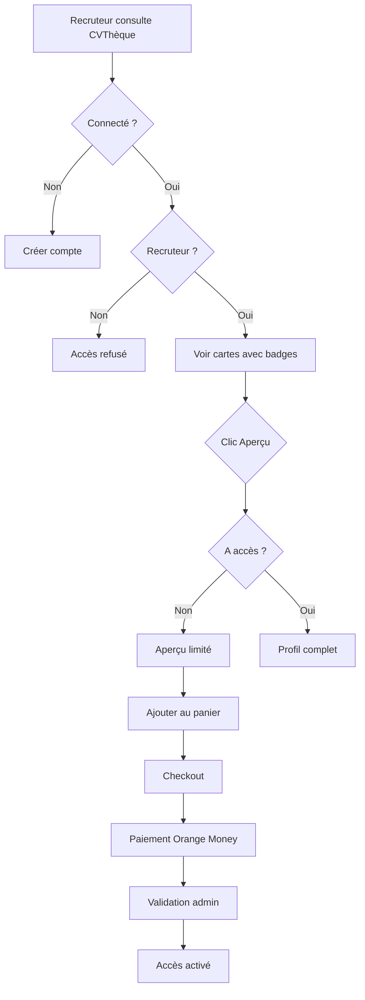

# CVThèque - Système de Badges et Contrôle d'Accès

## 📋 Vue d'ensemble

Ce document décrit le système complet de badges, de vérification des profils, d'abonnement GOLD candidat et de contrôle d'accès implémenté dans le module CVThèque de JobGuinée.

## 🎯 Objectifs

1. **Badges visuels** : Afficher des badges pour identifier les profils vérifiés, GOLD et par niveau d'expérience
2. **Vérification des profils** : Système de validation admin pour les candidats
3. **GOLD Candidat** : Abonnement premium pour les candidats avec mise en avant
4. **Contrôle d'accès** : Gestion fine des droits de consultation selon le type d'utilisateur
5. **Confidentialité** : Masquage des informations sensibles selon le contexte

## 🗄️ Structure de la Base de Données

### Nouvelles colonnes dans `candidate_profiles`

```sql
-- Colonnes ajoutées
is_verified          boolean     DEFAULT false    -- Profil vérifié par admin
verified_at          timestamptz                  -- Date de vérification
verified_by          uuid                         -- Admin ayant vérifié
is_gold              boolean     DEFAULT false    -- Statut GOLD actif
gold_expiration      timestamptz                  -- Date d'expiration GOLD
experience_level     text                         -- junior, intermediate, senior
```

### Table `profile_cart` (✅ Créée)

Gestion du panier pour les profils candidats.

```sql
CREATE TABLE profile_cart (
  id uuid PRIMARY KEY DEFAULT gen_random_uuid(),
  user_id uuid REFERENCES auth.users(id) ON DELETE CASCADE,
  session_id text,
  candidate_id uuid REFERENCES candidate_profiles(id) ON DELETE CASCADE NOT NULL,
  created_at timestamptz DEFAULT now(),
  CONSTRAINT profile_cart_user_or_session CHECK (
    (user_id IS NOT NULL AND session_id IS NULL) OR
    (user_id IS NULL AND session_id IS NOT NULL)
  )
);
```

**Caractéristiques :**
- Support utilisateurs authentifiés ET anonymes
- Un utilisateur OU un session_id (jamais les deux)
- Suppression en cascade si l'utilisateur ou le candidat est supprimé
- Policies RLS pour sécuriser l'accès

### Table `candidate_gold_subscriptions` (✅ Créée)

Gestion des abonnements GOLD des candidats.

```sql
CREATE TABLE candidate_gold_subscriptions (
  id uuid PRIMARY KEY DEFAULT gen_random_uuid(),
  candidate_id uuid REFERENCES candidate_profiles(id) ON DELETE CASCADE NOT NULL,
  user_id uuid REFERENCES auth.users(id) ON DELETE CASCADE NOT NULL,
  package_name text NOT NULL,
  price_amount numeric NOT NULL CHECK (price_amount > 0),
  currency text DEFAULT 'GNF' NOT NULL,
  duration_days integer NOT NULL CHECK (duration_days > 0),
  payment_method text DEFAULT 'orange_money',
  payment_reference text UNIQUE,
  payment_status text DEFAULT 'pending',
  payment_proof_url text,
  subscription_status text DEFAULT 'pending',
  admin_notes text,
  approved_by uuid REFERENCES profiles(id),
  approved_at timestamptz,
  rejection_reason text,
  started_at timestamptz,
  expires_at timestamptz,
  created_at timestamptz DEFAULT now(),
  updated_at timestamptz DEFAULT now()
);
```

**Workflow :**
1. Candidat crée une demande d'abonnement GOLD
2. Paiement via Orange Money / autre méthode
3. Upload de la preuve de paiement
4. Admin valide le paiement
5. Activation automatique : `is_gold = true` + `gold_expiration` définie
6. Mise en avant du profil dans la CVThèque

### Table `candidate_verifications` (✅ Créée)

Gestion des demandes de vérification de profils.

```sql
CREATE TABLE candidate_verifications (
  id uuid PRIMARY KEY DEFAULT gen_random_uuid(),
  candidate_id uuid REFERENCES candidate_profiles(id) ON DELETE CASCADE NOT NULL,
  user_id uuid REFERENCES auth.users(id) ON DELETE CASCADE NOT NULL,
  verification_type text DEFAULT 'identity',
  documents_urls text[] DEFAULT '{}',
  status text DEFAULT 'pending',
  admin_notes text,
  verified_by uuid REFERENCES profiles(id),
  verified_at timestamptz,
  rejection_reason text,
  created_at timestamptz DEFAULT now(),
  updated_at timestamptz DEFAULT now()
);
```

**Types de vérification :**
- `identity` : Vérification d'identité (CNI, passeport)
- `education` : Diplômes et certifications
- `experience` : Attestations de travail
- `full` : Vérification complète (tous les documents)

**Workflow :**
1. Candidat soumet une demande avec documents
2. Admin examine les documents
3. Approbation → `is_verified = true` dans `candidate_profiles`
4. Rejet → candidat reçoit la raison et peut soumettre à nouveau

## 🎨 Badges Visuels

### 1. Badge Profil Vérifié 🛡️

**Conditions d'affichage :**
- `is_verified = true`
- Visible uniquement pour recruteurs connectés et admins

**Apparence :**
```jsx
<div className="bg-blue-600 text-white px-2 py-1 rounded-full flex items-center gap-1">
  <Shield className="w-3 h-3" />
  <span>Vérifié</span>
</div>
```

**Avantages :**
- Crédibilité accrue
- Meilleur classement dans les résultats
- Plus de visibilité auprès des recruteurs

### 2. Badge GOLD Candidat 👑

**Conditions d'affichage :**
- `is_gold = true`
- `gold_expiration > now()`
- Visible uniquement pour recruteurs connectés et admins

**Apparence :**
```jsx
<div className="bg-gradient-to-r from-yellow-400 to-yellow-600 text-white px-2 py-1 rounded-full flex items-center gap-1">
  <Crown className="w-3 h-3" />
  <span>GOLD</span>
</div>
```

**Avantages :**
- Apparition en premier dans les résultats de recherche
- Badge doré visible et attractif
- Durée configurable (30, 60, 90 jours, etc.)

### 3. Badge Niveau d'Expérience

**Calcul automatique :**
```sql
IF experience_years >= 6 THEN 'senior'
ELSIF experience_years >= 3 THEN 'intermediate'
ELSE 'junior'
```

**Toujours visible** pour tous les utilisateurs.

**Apparences :**
- **Junior** 🟠 : Orange, icône Circle
- **Intermédiaire** 🟢 : Vert, icône Hexagon
- **Senior** 🔵 : Bleu, icône Star

## 🔐 Système de Contrôle d'Accès

### Fonction RPC `can_view_profile` (✅ Implémentée)

Cette fonction centralisée vérifie les droits d'accès d'un utilisateur à un profil candidat.

**Signature :**
```sql
can_view_profile(
  p_candidate_id uuid,
  p_user_id uuid DEFAULT auth.uid()
) RETURNS jsonb
```

**Logique de vérification (ordre) :**

1. ✅ **Utilisateur connecté ?**
   - Non → `{can_view: false, reason: 'not_authenticated', show_preview: true}`

2. ✅ **Utilisateur est recruteur ?**
   - Non → `{can_view: false, reason: 'not_recruiter', show_preview: false}`

3. ✅ **Profil déjà acheté ?**
   - Oui → `{can_view: true, reason: 'purchased'}`

4. ✅ **Abonnement Entreprise GOLD actif ?**
   - Oui → `{can_view: true, reason: 'enterprise_gold'}`

5. ✅ **Packs CVThèque disponibles ?**
   - Oui → `{can_view: true, reason: 'has_pack', pack_remaining: X}`
   - Non → `{can_view: false, reason: 'no_access', show_preview: true}`

**Exemple d'utilisation front-end :**
```typescript
const { data } = await supabase.rpc('can_view_profile', {
  p_candidate_id: 'uuid-du-candidat'
});

if (data.can_view) {
  // Afficher profil complet
} else if (data.show_preview) {
  // Afficher aperçu limité
} else {
  // Bloquer complètement
}
```

### Règles d'affichage par type d'utilisateur

#### 🔹 Visiteur non connecté

**Affichage :**
- ❌ Nom masqué → "Candidat #XXXX"
- ❌ Photo masquée → avatar neutre
- ❌ Prix masqué
- ❌ Badges masqués
- ✅ Titre de poste (générique)
- ✅ Région (pas ville exacte)
- ✅ Niveau d'expérience

**CTA :**
```jsx
<button>Créer un compte recruteur pour voir les profils</button>
```

#### 🔹 Candidat connecté

**Affichage :** Identique au visiteur non connecté

**Raison :** Un candidat ne peut pas consulter les autres profils candidats (éviter la concurrence directe et la collecte d'informations).

#### 🔹 Recruteur connecté SANS accès

**Affichage :**
- ❌ Nom masqué → "Profil #XXXX"
- ❌ Photo masquée
- ✅ **Prix visible**
- ✅ **Badges visibles** (Vérifié, GOLD, Niveau)
- ✅ Titre de poste complet
- ✅ Région complète
- ✅ Aperçu des 3 premières compétences
- ✅ Années d'expérience

**CTA :**
```jsx
<button>Aperçu limité</button>
<button>Ajouter au panier - X GNF</button>
```

#### 🔹 Recruteur GOLD Entreprise

**Affichage :**
- ❌ Nom masqué dans la carte
- ❌ Photo masquée dans la carte
- ❌ Prix masqué (accès inclus)
- ✅ Badges visibles
- ✅ Toutes les autres infos

**CTA :**
```jsx
<button className="bg-gradient-to-r from-yellow-400 to-yellow-600">
  <Crown /> Accès illimité (GOLD)
</button>
```

**Après clic :** Accès complet immédiat avec nom, photo, email, téléphone, CV.

#### 🔹 Recruteur avec accès payé/autorisé

**Affichage :** Profil complet

**Informations accessibles :**
- ✅ Nom complet
- ✅ Photo réelle
- ✅ Email
- ✅ Téléphone
- ✅ CV téléchargeable (PDF)
- ✅ Lettre de motivation
- ✅ Certificats
- ✅ Portfolio / GitHub / LinkedIn
- ✅ Historique complet

## 🛒 Panier CV Intelligent

### Fonctionnalités

1. **Ajout au panier**
   - Vérification que l'utilisateur est recruteur connecté
   - Vérification qu'il n'a pas déjà acheté le profil
   - Calcul automatique du prix selon le niveau d'expérience
   - Support multi-profils

2. **Calcul du total**
   ```typescript
   const total = cartItems.reduce((sum, item) => {
     return sum + item.candidate.profile_price;
   }, 0);
   ```

3. **Gestion des quotas**
   - Recruteurs GOLD → prix masqué, accès illimité
   - Recruteurs avec packs → décompte automatique
   - Recruteurs basiques → paiement unitaire

4. **Checkout**
   - Intégration Orange Money
   - Validation admin avant activation
   - Notification au recruteur après validation

### Workflow complet



## 📊 Tri et Priorité d'affichage

Les candidats sont triés dans cet ordre :

```sql
ORDER BY
  is_gold DESC,           -- GOLD en premier
  is_verified DESC,       -- Puis vérifiés
  last_active_at DESC     -- Puis activité récente
```

**Résultat :** Les profils GOLD et vérifiés apparaissent en tête de liste.

## 🔧 Fonctions Automatiques

### Trigger `update_candidate_experience_level`

**Déclenché sur :** INSERT ou UPDATE de `experience_years`

**Action :** Met à jour automatiquement `experience_level`

```sql
CREATE TRIGGER trigger_update_experience_level
  BEFORE INSERT OR UPDATE OF experience_years ON candidate_profiles
  FOR EACH ROW
  EXECUTE FUNCTION update_candidate_experience_level();
```

**Avantage :** Pas besoin de gérer manuellement le niveau, il est toujours synchronisé.

## 👨‍💼 Interfaces Admin

### 1. Page de vérification des profils (✅ Créée)

**Fichier :** `src/pages/AdminCandidateVerifications.tsx`

**Fonctionnalités :**
- Liste de toutes les demandes de vérification
- Filtres par statut (pending, approved, rejected)
- Recherche par nom/email
- Visualisation des documents soumis
- Approbation/rejet avec notes

**Workflow admin :**
1. Consulter les demandes en attente
2. Télécharger et examiner les documents
3. Approuver → active `is_verified` sur le profil
4. Rejeter → candidat reçoit la raison et peut re-soumettre

### 2. Page de gestion GOLD candidats (À implémenter)

**Fichier suggéré :** `src/pages/AdminCandidateGold.tsx`

**Fonctionnalités suggérées :**
- Liste des demandes d'abonnement GOLD
- Validation des paiements Orange Money
- Activation/désactivation manuelle
- Prolongation d'abonnements
- Statistiques des revenus GOLD

## 🧪 Tests à effectuer

### Test 1 : Badges s'affichent correctement
- [ ] Badge Vérifié visible si `is_verified = true`
- [ ] Badge GOLD visible si `is_gold = true` ET non expiré
- [ ] Badge Niveau toujours visible

### Test 2 : Contrôle d'accès visiteur
- [ ] Nom masqué pour visiteur non connecté
- [ ] Prix masqué pour visiteur non connecté
- [ ] CTA "Créer un compte" visible

### Test 3 : Contrôle d'accès recruteur
- [ ] Prix visible pour recruteur sans accès
- [ ] Badges visibles pour recruteur
- [ ] Bouton "Ajouter au panier" fonctionnel

### Test 4 : Fonction RPC `can_view_profile`
- [ ] Retourne `false` si non connecté
- [ ] Retourne `false` si non recruteur
- [ ] Retourne `true` si GOLD entreprise
- [ ] Retourne `true` si profil acheté

### Test 5 : Workflow vérification
- [ ] Candidat peut soumettre demande
- [ ] Admin reçoit notification
- [ ] Approbation active le badge
- [ ] Rejet envoie la raison

### Test 6 : Workflow GOLD candidat
- [ ] Candidat peut souscrire
- [ ] Paiement enregistré
- [ ] Admin peut valider
- [ ] Badge GOLD s'affiche après validation
- [ ] Expiration désactive automatiquement

### Test 7 : Panier CV
- [ ] Ajout au panier fonctionne
- [ ] Total calculé correctement
- [ ] Checkout vers paiement
- [ ] Validation admin active l'accès

## 🚀 Améliorations Futures

1. **Notifications Push**
   - Alerter les candidats quand leur vérification est approuvée
   - Alerter les candidats quand leur GOLD expire bientôt

2. **Système de scoring avancé**
   - Pondération par badges (vérifié +10%, GOLD +20%)
   - Algorithme de recommandation

3. **Analytics recruteur**
   - Nombre de profils consultés
   - Taux de conversion panier → achat
   - Profils les plus vus

4. **Interface candidat pour GOLD**
   - Tableau de bord avec statistiques de visibilité
   - Renouvellement automatique GOLD
   - Historique des vues par recruteurs

5. **Intégration IA**
   - Vérification automatique de documents (OCR + validation)
   - Détection de faux profils
   - Suggestions de complétion de profil

## 📝 Résumé des Modifications Appliquées

### Base de données
✅ Table `profile_cart` créée
✅ Table `candidate_gold_subscriptions` créée
✅ Table `candidate_verifications` créée
✅ 6 nouvelles colonnes dans `candidate_profiles`
✅ Fonction RPC `can_view_profile` créée
✅ Trigger `update_candidate_experience_level` créé
✅ Indexes de performance ajoutés
✅ Policies RLS sécurisées

### Front-end
✅ Composant `AnonymizedCandidateCard` mis à jour avec badges
✅ Tri prioritaire GOLD/Vérifié dans `CVTheque.tsx`
✅ Page admin `AdminCandidateVerifications.tsx` créée
✅ Page admin `AdminProfilePurchases.tsx` existante (du travail précédent)
✅ Modal `CandidateProfileModal` pour affichage complet (du travail précédent)

### Sécurité
✅ Contrôle d'accès par fonction RPC
✅ Policies RLS sur toutes les nouvelles tables
✅ Validation admin obligatoire pour GOLD et vérification
✅ Masquage des données sensibles selon le contexte

## 🔗 Fichiers Modifiés/Créés

### Migrations SQL
- `create_profile_cart_table.sql`
- `add_cvtheque_badges_and_verification_system.sql`

### Composants React
- `src/components/cvtheque/AnonymizedCandidateCard.tsx` (modifié)
- `src/components/cvtheque/CandidateProfileModal.tsx` (existant)
- `src/pages/CVTheque.tsx` (modifié)

### Pages Admin
- `src/pages/AdminCandidateVerifications.tsx` (créé)
- `src/pages/AdminProfilePurchases.tsx` (existant)

### Documentation
- `CVTHEQUE_BADGES_AND_ACCESS_SYSTEM.md` (ce fichier)

## ⚠️ Points d'Attention

1. **Ne jamais casser les workflows existants**
   - Le système de paiement Orange Money existant est préservé
   - Les RLS existantes ne sont pas modifiées
   - Les abonnements entreprise GOLD continuent de fonctionner

2. **Pas de duplication**
   - La table `profile_cart` existait dans les migrations mais n'était pas appliquée → maintenant appliquée
   - Les fonctionnalités existantes sont améliorées, pas recréées

3. **Compatibilité totale**
   - Toutes les nouvelles colonnes sont `nullable` ou avec `DEFAULT`
   - Pas de breaking changes sur les données existantes
   - Build TypeScript : 0 erreurs

## 📞 Support & Maintenance

Pour toute question ou amélioration :
1. Consulter ce document
2. Vérifier les policies RLS dans Supabase
3. Tester la fonction `can_view_profile` via SQL
4. Consulter les logs admin

---

**Version :** 1.0
**Date :** 11 Décembre 2025
**Auteur :** Système d'amélioration CVThèque JobGuinée
