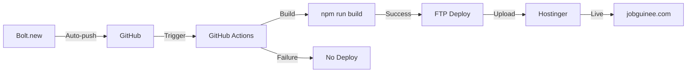

# 📦 Résumé du Déploiement Continu JobGuinée

## ✅ Ce qui a été configuré

### 1. Pipeline CI/CD GitHub Actions

**Fichiers créés :**
- `.github/workflows/deploy-production.yml` - Déploiement automatique sur push vers main
- `.github/workflows/ci-checks.yml` - Vérifications de qualité sur toutes les branches

**Fonctionnalités :**
- ✅ Build automatique du projet
- ✅ Tests TypeScript
- ✅ Vérifications de sécurité
- ✅ Déploiement FTP vers Hostinger
- ✅ Vérification post-déploiement

### 2. Scripts de déploiement

**Fichiers créés :**
- `scripts/deployment/pre-deploy-check.sh` - Vérification pré-déploiement (40+ checks)
- `scripts/deployment/deploy.sh` - Script principal de déploiement
- `scripts/deployment/verify-deployment.sh` - Vérification post-déploiement (6 tests)
- `scripts/deployment/README.md` - Documentation des scripts

**Capacités :**
- ✅ Vérification complète de l'environnement
- ✅ Détection des secrets exposés
- ✅ Création automatique du .htaccess
- ✅ Tests de disponibilité et performance
- ✅ Vérification HTTPS et sécurité

### 3. Configuration des variables d'environnement

**Fichiers créés :**
- `.env.example` (mis à jour) - Configuration développement local
- `.env.example.production` - Configuration production complète avec 100+ variables documentées
- `.gitignore` (enrichi) - Protection contre les commits de secrets

**Organisation :**
- ✅ Variables frontend (VITE_*)
- ✅ Variables backend (sans VITE_)
- ✅ Configuration Supabase
- ✅ Configuration paiements (Orange Money, MTN)
- ✅ Configuration IA/OpenAI
- ✅ Configuration SEO & Analytics
- ✅ Configuration déploiement

### 4. Documentation complète

**Fichiers créés :**
- `DEPLOYMENT_GUIDE.md` - Guide complet 300+ lignes
- `DEPLOYMENT_CHECKLIST.md` - Checklist de validation détaillée
- `QUICK_START_DEPLOYMENT.md` - Guide de démarrage rapide (15 min)
- `DEPLOYMENT_SUMMARY.md` - Ce fichier

**Contenu :**
- ✅ Instructions pas à pas
- ✅ Configuration GitHub et Hostinger
- ✅ Gestion des secrets
- ✅ Procédures de rollback
- ✅ Troubleshooting complet
- ✅ Vérifications post-déploiement

---

## 🚀 Flux de déploiement automatique



### Étapes automatiques

1. **Modification dans Bolt.new** → Sauvegarde
2. **Push automatique** vers GitHub (branche main)
3. **GitHub Actions déclenché** automatiquement
4. **Installation** des dépendances (`npm ci`)
5. **Type checking** TypeScript (continue même si warnings)
6. **Build production** avec variables d'environnement
7. **Upload FTP** vers Hostinger
8. **Vérification** automatique du déploiement
9. **Site en ligne** ✅

**Durée totale : 3-5 minutes**

---

## 🔐 Secrets GitHub requis

Configuration dans : `Repository → Settings → Secrets and variables → Actions`

### Obligatoires (7 secrets)

| Secret | Exemple | Usage |
|--------|---------|-------|
| `VITE_SUPABASE_URL` | `https://xxx.supabase.co` | Connexion Supabase |
| `VITE_SUPABASE_ANON_KEY` | `eyJhbGc...` | Authentification |
| `FTP_HOST` | `ftp.jobguinee.com` | Serveur FTP |
| `FTP_USERNAME` | `username@jobguinee.com` | Login FTP |
| `FTP_PASSWORD` | `********` | Mot de passe FTP |
| `FTP_SERVER_DIR` | `/public_html/` | Dossier destination |
| `SITE_URL` | `https://jobguinee.com` | URL de vérification |

### Optionnels (selon fonctionnalités)

- `OPENAI_API_KEY` - Services IA
- `ORANGE_MONEY_API_KEY` - Paiements Orange Money
- `MTN_MOMO_API_KEY` - Paiements MTN
- `VITE_GA_TRACKING_ID` - Google Analytics

---

## 📋 Checklist de mise en production

### Avant le premier déploiement

- [ ] Repository GitHub créé et connecté à Bolt.new
- [ ] Les 7 secrets obligatoires configurés dans GitHub
- [ ] SSL/HTTPS activé sur Hostinger
- [ ] Accès FTP vérifié manuellement
- [ ] Variables Supabase correctes
- [ ] Build local réussit (`npm run build`)
- [ ] Script de vérification passé (`./scripts/deployment/pre-deploy-check.sh`)

### Pour chaque déploiement

- [ ] Tests locaux effectués
- [ ] Aucune erreur critique en console
- [ ] Commit poussé vers GitHub
- [ ] Workflow GitHub Actions surveillé
- [ ] Site vérifié après déploiement
- [ ] Tests fonctionnels critiques effectués

---

## 🛠️ Commandes utiles

### Développement local

```bash
# Installer les dépendances
npm install

# Lancer en développement
npm run dev

# Build de test
npm run build

# Prévisualiser le build
npm run preview

# Type checking
npm run typecheck
```

### Scripts de déploiement

```bash
# Vérification pré-déploiement
./scripts/deployment/pre-deploy-check.sh

# Test du script de déploiement (sans FTP)
./scripts/deployment/deploy.sh

# Vérification post-déploiement
SITE_URL=https://jobguinee.com ./scripts/deployment/verify-deployment.sh
```

### Git et GitHub

```bash
# Voir l'état Git
git status

# Voir l'historique
git log --oneline

# Rollback vers un commit précédent
git revert <commit-hash>
```

---

## 📊 Métriques et monitoring

### Temps de déploiement

- **Build** : 2-3 minutes
- **Upload FTP** : 1-2 minutes
- **Vérification** : 30 secondes
- **Total** : 3-5 minutes

### Taille du build

- **Assets** : ~3-5 MB (compressé)
- **Nombre de fichiers** : ~100-150
- **Chunks principaux** : 5-10 fichiers JS

### Performance cible

- **Temps de chargement** : < 3 secondes
- **HTTPS** : Obligatoire ✅
- **Compression** : gzip/brotli activé
- **Cache** : Headers configurés

---

## 🔄 Procédure de rollback

### Si un déploiement est défectueux

**Option 1 : Correction rapide (recommandé)**
```bash
# 1. Corriger dans Bolt.new
# 2. Sauvegarder
# 3. Attendre nouveau déploiement automatique (3-5 min)
```

**Option 2 : Rollback Git**
```bash
# 1. Identifier le dernier commit fonctionnel
git log --oneline

# 2. Revert vers ce commit
git revert <commit-hash>

# 3. Push (déploiement automatique)
git push
```

**Option 3 : Rollback FTP manuel**
```bash
# 1. Se connecter en FTP
# 2. Restaurer depuis backup local
# 3. Ou re-upload le dernier build fonctionnel
```

---

## 🐛 Résolution des problèmes courants

### Build échoue

```bash
# Vérifier localement
npm run build

# Voir les erreurs TypeScript
npm run typecheck

# Réinstaller les dépendances
rm -rf node_modules package-lock.json
npm install
```

### FTP échoue

1. Vérifier les secrets GitHub (credentials FTP)
2. Tester manuellement la connexion FTP
3. Vérifier que le chemin `FTP_SERVER_DIR` existe
4. Contacter support Hostinger si blocage IP

### Site en blanc

1. Vérifier que le build s'est bien uploadé
2. Vérifier le fichier `.htaccess` est présent
3. Vérifier les logs d'erreur dans la console (F12)
4. Vérifier les variables d'environnement Supabase

---

## 📞 Support et ressources

### Documentation

- [DEPLOYMENT_GUIDE.md](./DEPLOYMENT_GUIDE.md) - Guide complet
- [DEPLOYMENT_CHECKLIST.md](./DEPLOYMENT_CHECKLIST.md) - Checklist détaillée
- [QUICK_START_DEPLOYMENT.md](./QUICK_START_DEPLOYMENT.md) - Démarrage rapide

### Liens utiles

- [GitHub Actions Docs](https://docs.github.com/actions)
- [Hostinger Support](https://support.hostinger.com)
- [Supabase Docs](https://supabase.com/docs)

### Status pages

- [GitHub Status](https://www.githubstatus.com)
- [Supabase Status](https://status.supabase.com)

---

## ✅ État actuel

**Statut** : Pipeline CI/CD configuré et prêt ✅

**Configuration complétée** :
- ✅ Workflows GitHub Actions
- ✅ Scripts de déploiement et vérification
- ✅ Configuration des variables d'environnement
- ✅ Documentation complète
- ✅ Sécurité (.gitignore enrichi)
- ✅ Tests automatiques

**Actions requises pour activation** :
1. Configurer les 7 secrets GitHub
2. Activer SSL sur Hostinger
3. Faire un premier déploiement de test

**Une fois activé** :
- Toute modification dans Bolt.new sera automatiquement déployée
- Temps de déploiement : 3-5 minutes
- Vérifications automatiques à chaque déploiement
- Rollback possible en cas de problème

---

## 🎉 Prochaines étapes

1. **Configuration initiale** : Suivre [QUICK_START_DEPLOYMENT.md](./QUICK_START_DEPLOYMENT.md)
2. **Premier déploiement** : Tester avec un petit commit
3. **Vérification** : Utiliser la checklist [DEPLOYMENT_CHECKLIST.md](./DEPLOYMENT_CHECKLIST.md)
4. **Production** : Développer sereinement dans Bolt.new !

---

**Date de configuration** : 2026-01-03

**Version** : 1.0.0

**Statut** : ✅ Prêt pour la production
