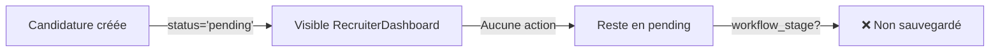
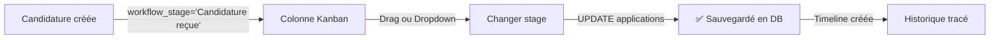

# PIPELINE A1 - AUDIT COMPLET DE L'EXISTANT
## Diagnostic du Pipeline de Recrutement - JobGuinée

**Date**: 12 décembre 2024
**Objectif**: Analyser l'existant pour implémenter un pipeline de recrutement par offre

---

## 📋 RÉSUMÉ EXÉCUTIF

### Constat Principal
🔴 **CRITIQUE**: Le système de pipeline/workflow existe dans le CODE mais **N'EXISTE PAS dans la BASE DE DONNÉES**.

- ✅ Code frontend préparé (composants + logique)
- ✅ Migration créée mais **NON APPLIQUÉE**
- ❌ Table `workflow_stages` absente de la DB
- ❌ Champ `workflow_stage` absent de la table `applications`
- ⚠️ Le système utilise des **données de démo** (sampleWorkflowStages)

### Impact
Le RecruiterDashboard charge des workflow_stages depuis la DB, mais si vide, il fallback sur des données sample. Le KanbanBoard fonctionne en mode "simulation" avec des données fictives.

---

## 🗺️ 1. ROUTES ET PAGES

### Routes Principales

| Route | Page/Composant | Description |
|-------|----------------|-------------|
| `recruiter-dashboard` | `RecruiterDashboard.tsx` | Hub principal recruteur |
| `job-detail` | `JobDetail.tsx` | Détails d'une offre |
| N/A | Pas de route dédiée | Aucune route spécifique pour pipeline/offre |

### Navigation Interne (RecruiterDashboard)

Le dashboard utilise un système d'onglets internes:

```typescript
type Tab = 'dashboard' | 'projects' | 'applications' | 'ai-generator' |
           'messages' | 'analytics' | 'premium' | 'profile' | 'purchased-profiles';
```

**Onglet concerné par le pipeline**: `'applications'`

---

## 🎨 2. COMPOSANTS UI CLÉS

### 2.1 RecruiterDashboard (`src/pages/RecruiterDashboard.tsx`)

**Rôle**: Hub principal avec vue d'ensemble des offres et candidatures

**Onglets liés au pipeline**:
- `dashboard`: Vue générale (stats, graphiques)
- `projects`: Liste des offres publiées
- `applications`: **Vue liste OU vue kanban** des candidatures

**Système de vue**:
```typescript
const [viewMode, setViewMode] = useState<'list' | 'kanban'>('list');
```

**Filtres disponibles**:
- Par offre: `selectedJobFilter` (dropdown)
- Par catégorie IA: `filterCategory` ('all', 'strong', 'medium', 'weak')

**Fonctions clés**:
```typescript
- loadData(): Charge jobs, applications, workflow_stages depuis DB
- handleMoveApplication(applicationId, newStage): Met à jour workflow_stage
- handleStartMatching(job): Lance modal Matching IA
- handleUpdateScores(): Met à jour ai_score et ai_category après matching
```

### 2.2 KanbanBoard (`src/components/recruiter/KanbanBoard.tsx`)

**Rôle**: Vue pipeline type Trello (colonnes = stages)

**Props**:
```typescript
interface KanbanBoardProps {
  applications: Application[];
  stages: Stage[];
  onMoveApplication: (applicationId: string, newStage: string) => void;
  onViewProfile: (applicationId: string) => void;
  onMessage: (applicationId: string) => void;
}
```

**Structure**:
- Colonnes = `stages` (workflow_stages)
- Cartes = `applications` filtrées par `workflow_stage`
- Drag & drop: **NON IMPLÉMENTÉ** (seulement dropdown manuel)

**Fonctionnalités**:
- Toggle expand/collapse par colonne
- Affichage score IA (94%, 🟢 Fort / 🟡 Moyen / 🔴 Faible)
- Actions: Voir profil, Envoyer message

### 2.3 ApplicationCard (`src/components/recruiter/ApplicationCard.tsx`)

**Rôle**: Carte individuelle d'une candidature (vue liste)

**Affichage**:
- Avatar + Nom + Titre
- Score IA (%) + Badge catégorie (Fort/Moyen/Faible)
- Expérience, formation, compétences
- Date de candidature
- Actions: Télécharger CV, Contacter, Voir profil

**Pas de gestion du workflow_stage** dans ce composant

### 2.4 AIMatchingModal (`src/components/recruiter/AIMatchingModal.tsx`)

**Rôle**: Lancer analyse IA et scoring des candidatures

**Workflow**:
1. Sélection des candidats à analyser
2. Estimation du coût (crédits/GNF)
3. Consommation crédits ou quota abonnement
4. Analyse IA (appel service)
5. Mise à jour `ai_score` et `ai_category`

**Important**: Ce modal **NE CHANGE PAS** le `workflow_stage`, seulement le scoring IA.

### 2.5 Autres Composants

- `DashboardStats`: Statistiques globales
- `AnalyticsDashboard`: Graphs et métriques avancées
- `JobPublishForm`: Création/édition d'offres
- `RecruiterProfileForm`: Profil recruteur
- `PremiumPlans`: Souscription Premium

---

## 🗄️ 3. TABLES DATABASE

### 3.1 Table `applications`

**Colonnes existantes**:
```sql
id                uuid PRIMARY KEY
job_id            uuid (FK jobs)
candidate_id      uuid (FK auth.users)
status            text DEFAULT 'pending'
cover_letter      text
applied_at        timestamptz DEFAULT now()
updated_at        timestamptz DEFAULT now()
ai_match_score    integer (0-100)
```

**Colonnes MANQUANTES** (prévues dans migration mais non appliquées):
```sql
❌ ai_score            integer DEFAULT 0
❌ ai_category         text DEFAULT 'medium'
❌ workflow_stage      text DEFAULT 'received'
❌ cv_url              text
❌ recruiter_notes     text
❌ ai_match_explanation text
```

**Valeurs `status` actuelles**:
```sql
CHECK (status IN ('pending', 'reviewed', 'shortlisted', 'interview', 'rejected', 'accepted'))
```

⚠️ **PROBLÈME**: Le champ `status` existe mais n'est PAS utilisé pour le pipeline. Le code utilise `workflow_stage` qui n'existe pas en DB !

### 3.2 Table `workflow_stages` (NON EXISTANTE)

**Structure prévue** (migration `20251031130406_create_advanced_ats_workflow_system_v2.sql`):
```sql
CREATE TABLE workflow_stages (
  id uuid PRIMARY KEY,
  company_id uuid REFERENCES companies(id) ON DELETE CASCADE,
  stage_name text NOT NULL,
  stage_order integer NOT NULL,
  stage_color text DEFAULT '#3B82F6',
  is_default boolean DEFAULT false,
  created_at timestamptz DEFAULT now(),
  updated_at timestamptz DEFAULT now()
);
```

**Index prévu**:
```sql
CREATE INDEX idx_workflow_stages_company ON workflow_stages(company_id);
CREATE INDEX idx_workflow_stages_order ON workflow_stages(stage_order);
```

**Statut**: ❌ **TABLE NON CRÉÉE**

### 3.3 Table `jobs`

**Colonnes pertinentes pour le pipeline**:
```sql
id                  uuid PRIMARY KEY
company_id          uuid (FK companies)
user_id             uuid (FK auth.users)
title               text
description         text
status              text DEFAULT 'draft' ('draft', 'published', 'closed')
created_at          timestamptz
applications_count  integer DEFAULT 0
views_count         integer DEFAULT 0
```

**Colonnes MANQUANTES** (prévues mais non appliquées):
```sql
❌ department          text
❌ ai_generated        boolean DEFAULT false
❌ hiring_manager_id   uuid
```

### 3.4 Table `companies`

**Colonnes**:
```sql
id                      uuid PRIMARY KEY
profile_id              uuid (FK profiles)
name                    text
description             text
logo_url                text
subscription_tier       text (none, basic, silver, gold) ❌ OBSOLÈTE
current_subscription    text (none, basic, silver, gold)
```

⚠️ **Doublon**: `subscription_tier` ET `current_subscription` (probablement un bug/legacy)

### 3.5 Autres Tables Connexes

**Tables prévues mais NON CRÉÉES**:
- ❌ `application_notes` (notes recruteur)
- ❌ `application_timeline` (historique changements)
- ❌ `recruiter_messages` (messagerie)
- ❌ `recruitment_analytics` (analytics quotidiennes)

---

## 🔧 4. SERVICES ET QUERIES

### 4.1 RecruiterDashboard - Chargement des Données

**Query principale** (`loadData`):
```typescript
// 1. Charger company
const { data: companyData } = await supabase
  .from('companies')
  .select('*')
  .eq('profile_id', profile.id)
  .maybeSingle();

// 2. Charger workflow_stages
const { data: stagesData } = await supabase
  .from('workflow_stages')
  .select('*')
  .eq('company_id', companyData.id)
  .order('stage_order');

// ⚠️ FALLBACK SI VIDE:
if (stagesData && stagesData.length > 0) {
  setWorkflowStages(stagesData);
} else {
  setWorkflowStages(sampleWorkflowStages); // ⚠️ DONNÉES DE DÉMO
}

// 3. Charger jobs
const { data: jobsData } = await supabase
  .from('jobs')
  .select('*')
  .eq('company_id', companyData.id)
  .order('created_at', { ascending: false });

// 4. Charger applications
const { data: appsData } = await supabase
  .from('applications')
  .select(`
    *,
    candidate:candidate_profiles!applications_candidate_id_fkey(
      id, title, experience_years, education_level, skills,
      profile:profiles!candidate_profiles_profile_id_fkey(
        full_name, email, phone, avatar_url
      )
    )
  `)
  .in('job_id', jobIds)
  .order('applied_at', { ascending: false });
```

### 4.2 Mise à Jour du Workflow

**Fonction** (`handleMoveApplication`):
```typescript
const handleMoveApplication = async (applicationId: string, newStage: string) => {
  const { error } = await supabase
    .from('applications')
    .update({ workflow_stage: newStage }) // ❌ COLONNE N'EXISTE PAS !
    .eq('id', applicationId);

  if (!error) {
    await loadData(); // Recharge tout
  }
};
```

⚠️ **PROBLÈME**: Mise à jour d'une colonne inexistante, mais sans erreur affichée car silencieux.

### 4.3 Services IA

**Service Matching IA**:
- `RecruiterAIMatchingService.batchAnalyzeApplications()`
- Appelle edge function `ai-matching-service`
- Retourne score + catégorie pour chaque candidat
- Met à jour `ai_score` et `ai_category`

**Service Pricing**:
- `RecruiterMatchingPricingService.estimateCost()`
- Calcule coût optimal (batch vs per candidate vs abonnement)
- Consomme crédits ou quota abonnement

---

## 🎯 5. WORKFLOW ET STATUTS ACTUELS

### 5.1 Statuts DB (`status` field)

**Enum dans la table `applications`**:
```
'pending', 'reviewed', 'shortlisted', 'interview', 'rejected', 'accepted'
```

**Utilisation**: ❌ **NON UTILISÉ** dans le code actuel !

### 5.2 Workflow Stages (Code)

**Stages de démo** (`sampleWorkflowStages`):
```typescript
[
  { id: 'stage-1', stage_name: 'Candidature reçue', stage_order: 1, stage_color: '#3B82F6' },
  { id: 'stage-2', stage_name: 'En évaluation', stage_order: 2, stage_color: '#F59E0B' },
  { id: 'stage-3', stage_name: 'Entretien planifié', stage_order: 3, stage_color: '#8B5CF6' },
  { id: 'stage-4', stage_name: 'Offre envoyée', stage_order: 4, stage_color: '#10B981' },
  { id: 'stage-5', stage_name: 'Refusé', stage_order: 5, stage_color: '#EF4444' },
  { id: 'stage-6', stage_name: 'Accepté', stage_order: 6, stage_color: '#059669' }
]
```

**Utilisation**: Applications de démo assignées à ces stages pour simulation UI.

### 5.3 Catégories IA

**Enum** (généré par le matching IA):
```
'strong', 'medium', 'weak'
```

**Affichage**:
- 🟢 Fort (strong) = Score 75-100%
- 🟡 Moyen (medium) = Score 50-74%
- 🔴 Faible (weak) = Score 0-49%

**Utilisation**: Filtrage et tri des candidatures.

---

## 🛡️ 6. SÉCURITÉ RLS

### 6.1 Policies `applications`

**SELECT**:
```sql
"Users can view applications they are involved in"
USING (
  auth.uid() = candidate_id OR
  EXISTS (
    SELECT 1 FROM jobs
    WHERE jobs.id = applications.job_id
    AND jobs.user_id = auth.uid()
  )
)
```
✅ **SÉCURISÉ**: Candidat voit ses candidatures, Recruteur voit candidatures de ses offres

**UPDATE**:
```sql
"Recruiters can update applications for their jobs"
USING (
  EXISTS (
    SELECT 1 FROM jobs
    WHERE jobs.id = applications.job_id
    AND jobs.user_id = auth.uid()
  )
)
```
✅ **SÉCURISÉ**: Seul le recruteur propriétaire de l'offre peut modifier

**INSERT**:
```sql
"Candidates can insert own applications"
```
✅ **SÉCURISÉ**: Les candidats peuvent postuler

### 6.2 Policies `workflow_stages` (Prévues)

**Dans la migration non appliquée**:
```sql
-- Admins peuvent tout faire
CREATE POLICY "Admins can manage workflow stages"

-- Recruteurs peuvent lire leurs stages
CREATE POLICY "Recruiters can read company workflow stages"
USING (
  EXISTS (
    SELECT 1 FROM companies
    WHERE companies.id = workflow_stages.company_id
    AND companies.profile_id = auth.uid()
  )
)

-- Recruteurs peuvent modifier leurs stages
CREATE POLICY "Recruiters can manage company workflow stages"
```

✅ **BIEN CONÇU**: Isolation par company_id

### 6.3 Filtrage par Job

**Problème actuel**: Le code charge TOUTES les applications de TOUTES les offres du recruteur en une seule query.

**Optimisation nécessaire**: Filtrer par `job_id` pour un pipeline spécifique à une offre.

---

## 🔍 7. ANALYSE DU PIPELINE EXISTANT

### 7.1 Existe-t-il un Pipeline ?

**Réponse**: ⚠️ **OUI ET NON**

| Aspect | Statut | Détails |
|--------|--------|---------|
| **Architecture code** | ✅ EXISTE | Composants KanbanBoard, logique handleMoveApplication |
| **Base de données** | ❌ N'EXISTE PAS | Tables workflow_stages, champs workflow_stage absents |
| **Données** | ⚠️ SIMULATION | Utilise sampleWorkflowStages et sampleApplications |
| **Fonctionnel** | ❌ NON | Impossible de sauvegarder les changements de stage |

### 7.2 Type de Pipeline

**Conception prévue**: Pipeline **PAR ENTREPRISE** (company_id)

- Chaque entreprise peut définir ses propres stages
- Stages configurables (nom, ordre, couleur)
- Stages par défaut fournis au démarrage

**Conception actuelle dans le code**: Pipeline **TOUS JOBS** d'un recruteur

- RecruiterDashboard charge toutes les applications
- Filtre par job via dropdown `selectedJobFilter`
- KanbanBoard affiche applications filtrées

### 7.3 Vue Kanban

**Fonctionnalités UI**:
- ✅ Colonnes représentant les stages
- ✅ Cartes d'applications dans chaque colonne
- ✅ Expand/collapse colonnes
- ✅ Dropdown pour changer de stage
- ❌ Drag & drop visuel

**Données affichées sur carte**:
- Avatar
- Nom + titre
- Score IA + badge
- Compétences (5 max)
- Actions: Message, Voir profil

### 7.4 Vue Liste

**Composant**: `ApplicationCard`

**Affichage**:
- Cartes empilées verticalement
- Informations détaillées (expérience, formation, compétences)
- Actions: Télécharger CV, Contacter, Voir profil

**Filtrage**:
- Par job (dropdown)
- Par catégorie IA (all, strong, medium, weak)

---

## 🚨 8. PROBLÈMES IDENTIFIÉS

### 8.1 Problèmes Critiques

| # | Problème | Impact | Priorité |
|---|----------|--------|----------|
| **P1** | Table `workflow_stages` absente | Pipeline non fonctionnel | 🔴 CRITIQUE |
| **P2** | Champ `workflow_stage` absent | Impossible de sauvegarder stage | 🔴 CRITIQUE |
| **P3** | Migration non appliquée | DB incomplète | 🔴 CRITIQUE |
| **P4** | Données de démo utilisées | Simulation, pas de prod | 🔴 CRITIQUE |

### 8.2 Problèmes Majeurs

| # | Problème | Impact | Priorité |
|---|----------|--------|----------|
| **P5** | Champ `status` non utilisé | Doublon avec workflow_stage | 🟠 MAJEUR |
| **P6** | Pas de pipeline par offre | Confusion recruteur multi-offres | 🟠 MAJEUR |
| **P7** | Pas de drag & drop | UX dégradée | 🟠 MAJEUR |
| **P8** | Tables annexes absentes | Pas de notes, timeline, messages | 🟠 MAJEUR |

### 8.3 Problèmes Mineurs

| # | Problème | Impact | Priorité |
|---|----------|--------|----------|
| **P9** | Doublon subscription_tier | Confusion | 🟡 MINEUR |
| **P10** | Pas d'historique changements | Pas de traçabilité | 🟡 MINEUR |
| **P11** | Reload complet après update | Performance | 🟡 MINEUR |

---

## 📊 9. GAP ANALYSIS

### 9.1 Ce qui Existe

✅ **Frontend**:
- RecruiterDashboard avec onglets
- KanbanBoard component
- ApplicationCard component
- Système de filtres (job, catégorie IA)
- Toggle vue liste/kanban
- AIMatchingModal pour scoring

✅ **Base de données**:
- Table `applications` (sans workflow_stage)
- Table `jobs`
- Table `companies`
- RLS policies sécurisées

✅ **Services**:
- Matching IA fonctionnel
- Pricing IA configuré
- Service de monétisation complet

### 9.2 Ce qui Manque

❌ **Base de données**:
- Table `workflow_stages`
- Champs additionnels dans `applications` (workflow_stage, ai_score, etc.)
- Tables annexes (notes, timeline, messages, analytics)

❌ **Frontend**:
- Pipeline spécifique par offre (vue dédiée)
- Drag & drop visuel
- Modal de détails candidature
- Formulaire notes recruteur
- Timeline des actions
- Messagerie intégrée

❌ **Backend**:
- Endpoint pour changer stage avec historique
- Endpoint pour ajouter notes
- Fonction auto-création stages par défaut

---

## 🎯 10. RECOMMANDATIONS

### 10.1 Actions Immédiates (Étape A2)

1. **Appliquer la migration**
   - Créer table `workflow_stages`
   - Ajouter champs manquants à `applications`
   - Créer fonction `auto_create_default_stages(company_id)`

2. **Initialiser les stages par défaut**
   - Trigger sur création company
   - Ou fonction manuelle callable par admin

3. **Tester le workflow existant**
   - Vérifier que handleMoveApplication fonctionne
   - Tester sauvegarde en DB

### 10.2 Améliorations UX (Étapes suivantes)

4. **Pipeline par offre**
   - Route `/recruiter/jobs/:jobId/pipeline`
   - Vue dédiée à une seule offre
   - Filtrage automatique des applications

5. **Drag & drop**
   - Intégrer bibliothèque react-dnd ou dnd-kit
   - Animation visuelle des mouvements
   - Confirmation avant changement de stage

6. **Modal détails candidature**
   - Toutes les infos candidat
   - Section notes recruteur
   - Timeline des actions
   - Actions rapides (message, changer stage, rejeter)

7. **Système de notes**
   - Table `application_notes`
   - CRUD complet
   - Affichage dans modal détails

### 10.3 Fonctionnalités Avancées (Long terme)

8. **Timeline/Historique**
   - Table `application_timeline`
   - Traçabilité complète des actions
   - Affichage chronologique

9. **Messagerie intégrée**
   - Table `recruiter_messages`
   - Thread par candidature
   - Notifications email

10. **Analytics par offre**
    - Taux de conversion par stage
    - Temps moyen par stage
    - Goulots d'étranglement

---

## 📁 11. FICHIERS CLÉS

### Frontend
```
src/pages/RecruiterDashboard.tsx                  [CORE]
src/components/recruiter/KanbanBoard.tsx          [PIPELINE UI]
src/components/recruiter/ApplicationCard.tsx      [CARD UI]
src/components/recruiter/AIMatchingModal.tsx      [MATCHING IA]
src/components/recruiter/DashboardStats.tsx       [STATS]
src/components/recruiter/AnalyticsDashboard.tsx   [ANALYTICS]
src/utils/sampleJobsData.ts                       [DEMO DATA]
```

### Backend/Database
```
supabase/migrations/20251031130406_create_advanced_ats_workflow_system_v2.sql  [À APPLIQUER]
supabase/migrations/20251030145854_extend_ats_system_for_recruiters.sql       [PARTIEL]
```

### Services
```
src/services/recruiterAIMatchingService.ts        [MATCHING IA]
src/services/recruiterMatchingPricingService.ts   [PRICING]
```

---

## 🔄 12. WORKFLOW ACTUEL VS PRÉVU

### 12.1 Workflow Actuel (Dysfonctionnel)



### 12.2 Workflow Prévu (Post-Migration)



---

## 📝 13. DONNÉES DE DÉMO

### Applications Sample

**Total**: 12 applications de démo
- 4 pour "Ingénieur Génie Civil"
- 4 pour "Responsable HSE"
- 4 pour "Chef de Projet Digital Marketing"

**Répartition workflow_stage**:
- "Candidature reçue": 4
- "En évaluation": 3
- "Entretien planifié": 2
- "Offre envoyée": 1
- "Refusé": 1
- "Accepté": 1

**Scores IA**:
- Strong (75-100%): 5 candidats
- Medium (50-74%): 4 candidats
- Weak (0-49%): 3 candidats

---

## 🎬 14. PROCHAINES ÉTAPES (Étape A2)

### Phase 1: Création du Modèle de Données

1. **Appliquer migration existante**
   ```sql
   -- Créer workflow_stages
   -- Ajouter colonnes à applications
   -- Créer indexes
   -- Configurer RLS
   ```

2. **Créer fonction d'initialisation**
   ```sql
   CREATE FUNCTION auto_create_default_stages(p_company_id uuid)
   -- Créer 6 stages par défaut
   ```

3. **Créer trigger sur company**
   ```sql
   CREATE TRIGGER after_company_insert
   AFTER INSERT ON companies
   FOR EACH ROW
   EXECUTE FUNCTION auto_create_default_stages(NEW.id);
   ```

### Phase 2: Tests et Validation

4. **Créer une company de test**
   - Vérifier création auto des stages
   - Vérifier que RecruiterDashboard charge correctement

5. **Tester le Kanban**
   - Créer des applications test
   - Changer workflow_stage
   - Vérifier sauvegarde en DB

6. **Nettoyer les données de démo**
   - Supprimer sampleWorkflowStages
   - Supprimer sampleApplications
   - Forcer usage des données réelles

---

## ✅ CONCLUSION

### État Actuel
Le système de pipeline est **conceptuellement complet** dans le code mais **techniquement non fonctionnel** car:
- ❌ Tables absentes de la DB
- ❌ Migration non appliquée
- ❌ Simulation avec données de démo

### Actions Requises
1. **URGENT**: Appliquer la migration workflow_stages
2. **URGENT**: Tester le système avec données réelles
3. **IMPORTANT**: Créer vue pipeline par offre
4. **SOUHAITABLE**: Ajouter drag & drop et fonctionnalités avancées

### Risques
- ⚠️ Le RecruiterDashboard charge workflow_stages de la DB, qui est vide → fallback sur sample
- ⚠️ handleMoveApplication tente de UPDATE workflow_stage qui n'existe pas → silencieux
- ⚠️ Les recruteurs pensent que leur pipeline fonctionne, mais rien n'est sauvegardé

### Points Positifs
- ✅ Architecture frontend bien conçue
- ✅ Séparation des responsabilités claire
- ✅ RLS bien configuré
- ✅ Migration prête à l'emploi
- ✅ Système de matching IA opérationnel

---

**FIN DU RAPPORT A1**

📌 **Prêt pour l'étape A2**: Création du modèle de données et implémentation du pipeline
